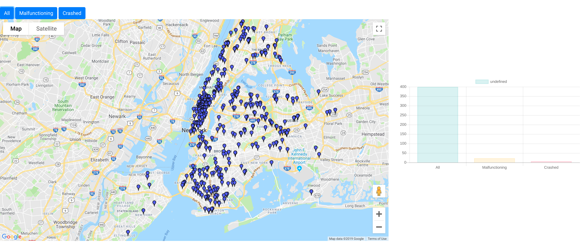
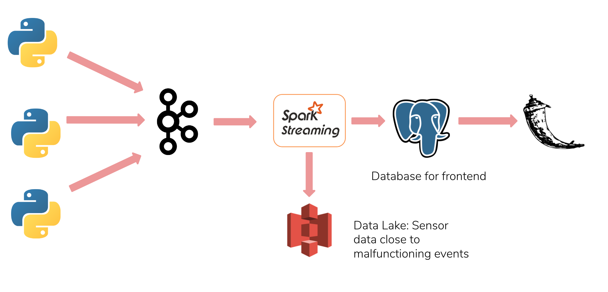

# Introduction

This project was built as a part of insight data engineering program. The project aims at building realtime streaming pipeline for sensor data from IoT sensors onboard Unmanned Autonomous Vehicles(UAV). For the use case presented here, the project collects data from 3 sensors onboard delivery drones to detect and monitor malfunctioning drones.

# Motivation

It is estimated that by the year 2026 there will be ~800,000 delivery drones making deliveries across US. Manually monitoring such large such large number of drones would be practically impossible. The goal of this project is 1) To provide realtime access to location of malfunctioning drones, 2) To store sensor data close to malfunctioning event for later analysis. The locations of malfunctioning drones would then allow flight operator at drone delivery companies to take appropriate actions. The sensor data close to malfunctioning events can be later analyzed to prevent future malfunctions.

The [web app](http://dronedetect.live/) provides locations of malfunctioning drones and crashed drones for easy access.

# Tools and Technologies used

1. Apache Kafka
1. Apache Spark Streaming
1. AWS S3 bucket
1. PostgreSQL
1. Flask

# Pipeline

The sensor data is streamed through kafka into spark streaming. Spark streaming calculates root mean square error of sensor data with characterized malfunctioning drone data to drone with unexpected flight path. The locations to malfunctioning drones is then displayed onto flask app so that flight operators at drone delivery companies can take appropriate actions. The sensor data close to malfunctioning events is stored into S3 bucket for later analysis.

# Cluster setup

1) 3 node Kafka cluster
2) 3 node Spark cluster
3) 1 node for PostgreSQL
4) 1 node for flask
5) S3 bucket

# Installation

### Kafka setup

Install and start kafka and zookeeper on a 3 node kafka cluster or run kafka_setup.sh.
Produce data using `bash src/scripts/kafka_submit.sh <Number of drones>`

### Spark setup

Install and start hadoop and spark on a 3 node spark cluster or run spark_setup.sh.
Start spark script using `bash src/scripts/sparksubmit.sh`

### PostgreSQL setup

Create an EC2 instance and run `setup/postgres.sh` to install and create PostgreSQL database.

### Flask setup

Run `bash setup/flask_app.sh` to create a flask node and install dependencies.
Run `sudo ./src/flask/run.py` to start webserver
